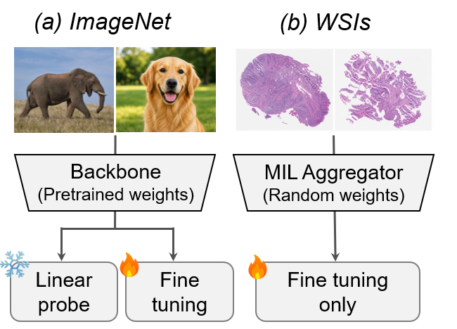
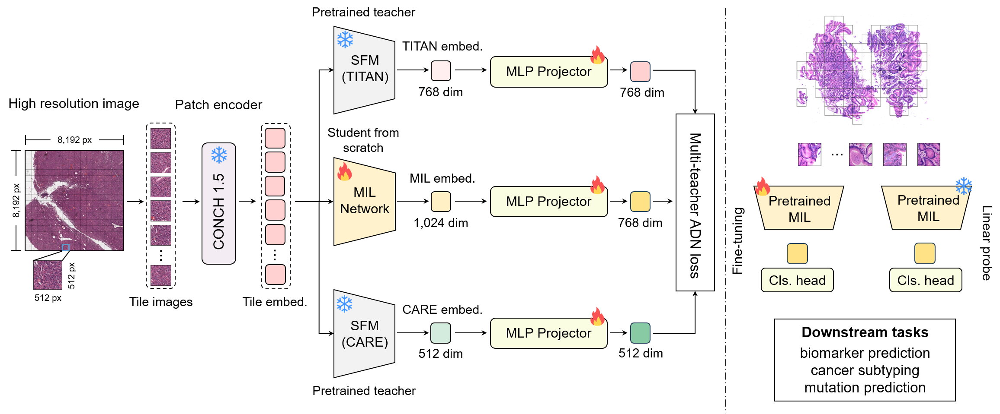

# Pretraining Multiple Instance Learning Networks with Multi-Teacher Distillation from Pathology Slide Foundation Models

## 1. Introduction

### Motivation



Pretrained backbones support freezing or fine-tuning in natural image analysis, whereas multiple instance learning (MIL) models for whole slide image (WSI) analysis are typically trained from scratch. This repository provides pretrained MIL weights, multi-teacher distillation training code, and downstream evaluation scripts for WSI-level tasks.

### Framework



Overview of the proposed framework. Left: ROI-level pretraining of the MIL network via multi-teacher distillation from TITAN and CARE. Right: transfer of the pretrained MIL aggregator to downstream WSI-level evaluation tasks.

## 2. Pretrained MIL Weights

The `pretrained_weight/` directory contains pretrained checkpoints for supported MIL backbones:

| MIL backbone | Pretrained weight |
| --- | --- |
| ABMIL | `pretrained_weight/pretrained_abmil.pt` |
| 2D-Mamba | `pretrained_weight/pretrained_2dmamba.pt` |
| CLAM-SB | `pretrained_weight/pretrained_clam_sb.pt` |
| CLAM-MB | `pretrained_weight/pretrained_clam_mb.pt` |
| AMD-MIL | `pretrained_weight/pretrained_amdmil.pt` |
| AEM-MIL | `pretrained_weight/pretrained_aemmil.pt` |
| DAgMIL | `pretrained_weight/pretrained_dagmil.pt` |
| GDF-MIL | `pretrained_weight/pretrained_gdfmil.pt` |
| TransMIL | `pretrained_weight/pretrained_transmil.pt` |
| WiKG | `pretrained_weight/pretrained_wikg.pt` |

These checkpoints can be loaded by the downstream scripts through `--pretrained_weights`. The helper script `test_downstream/benchmark_pretrain.sh` uses this directory by default.

## 3. Reproduce Pretrained MIL

### 3.1 Installation

```bash
conda create -n pretrained_mil python=3.10 -y
conda activate pretrained_mil
pip install -r requirements.txt
```

Install the CUDA/PyTorch build that matches your environment if the pinned versions in `requirements.txt` are not compatible with your system.

### 3.2 Repository Layout

```text
pretrained_weight/        # pretrained MIL checkpoints for downstream use
scripts/
  loss.py                 # distillation loss
  teacher_model.py        # TITAN/CARE teacher feature extraction helper
  wsi_distillation/
    run_ddp_feat_distill.py
                           # DDP feature distillation training entry point
test_downstream/          # downstream fine-tuning and evaluation scripts
piano/                    # MIL model implementations and factory, adapted from WonderLandxD/PIANO
requirements.txt          # Python dependencies
```

The MIL model structure and downstream testing pipeline follow [WonderLandxD/PIANO](https://github.com/WonderLandxD/PIANO).

### 3.3 Distillation Training

The main training script is:

```text
scripts/wsi_distillation/run_ddp_feat_distill.py
```

Example:

```bash
torchrun --nproc_per_node=4 scripts/wsi_distillation/run_ddp_feat_distill.py \
  --feat_dir /path/to/patch_features \
  --care_root /path/to/CARE \
  --titan_root /path/to/TITAN \
  --cache_file outputs/teacher_cache.pt \
  --ckpt_dir outputs/transmil_distill \
  --mil_name transmil \
  --teacher_mode both
```

`--feat_dir` should contain `.pth` feature files with patch features and coordinates. The teacher cache stores extracted TITAN/CARE summaries and is reused if it already exists.

Useful options:

```text
--mil_name          MIL student backbone, such as transmil, abmil, dagmil
--teacher_mode     both, titan_only, or care_only
--epochs           number of training epochs
--batch_size       per-GPU batch size
--save_every       checkpoint saving interval
--ckpt_dir         directory for periodic checkpoints
```

### 3.4 Downstream Evaluation

Downstream code is under:

```text
test_downstream/
```

The MIL downstream evaluation scripts are based on [WonderLandxD/PIANO](https://github.com/WonderLandxD/PIANO), with support for loading the pretrained MIL aggregators released in this repository.

Run from random initialization:

```bash
cd test_downstream
DATA_ROOT=/path/to/downstream_data \
JOB_DIR=results_scratch \
PFM_NAMES="conch_v1_5" \
SLIDE_NAMES="transmil" \
GPU_ID=0 \
bash benchmark_scratch.sh
```

Run with pretrained initialization:

```bash
cd test_downstream
DATA_ROOT=/path/to/downstream_data \
JOB_DIR=results_distill \
PFM_NAMES="conch_v1_5" \
SLIDE_NAMES="transmil" \
GPU_ID=0 \
bash benchmark_pretrain.sh
```

By default, `benchmark_pretrain.sh` looks for checkpoints in `../pretrained_weight`. You can override this with:

```bash
PRETRAINED_WEIGHTS_DIR=/path/to/pretrained_weight bash benchmark_pretrain.sh
```

or set one model-specific path:

```bash
PRETRAINED_WEIGHTS_TRANSMIL=/path/to/checkpoint bash benchmark_pretrain.sh
```

### 3.5 Data Format

Feature files are expected to be PyTorch `.pth` files containing at least:

```python
{
    "feats": Tensor,   # patch features, shape [N, D]
    "coords": Tensor,  # patch coordinates, shape [N, 2]
}
```

Downstream task JSON files are stored in `test_downstream/downstream_task_jsons/`. Paths may use `<PFM_NAME>` as a placeholder; it is replaced at runtime by `--pfm_name`.

For more details about the MIL data structure and downstream task organization, please refer to [WonderLandxD/PIANO](https://github.com/WonderLandxD/PIANO).

## 4. Notes

- Local datasets, model caches, teacher caches, and training outputs should not be committed.
- Configure all machine-specific paths with command-line arguments or environment variables.
- The repository does not include raw WSI data or third-party teacher model checkpoints.
